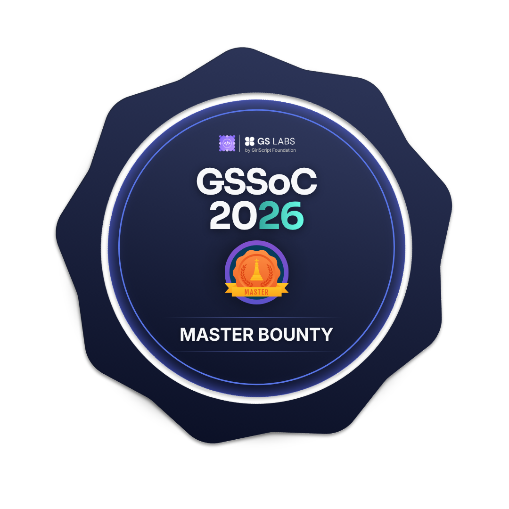
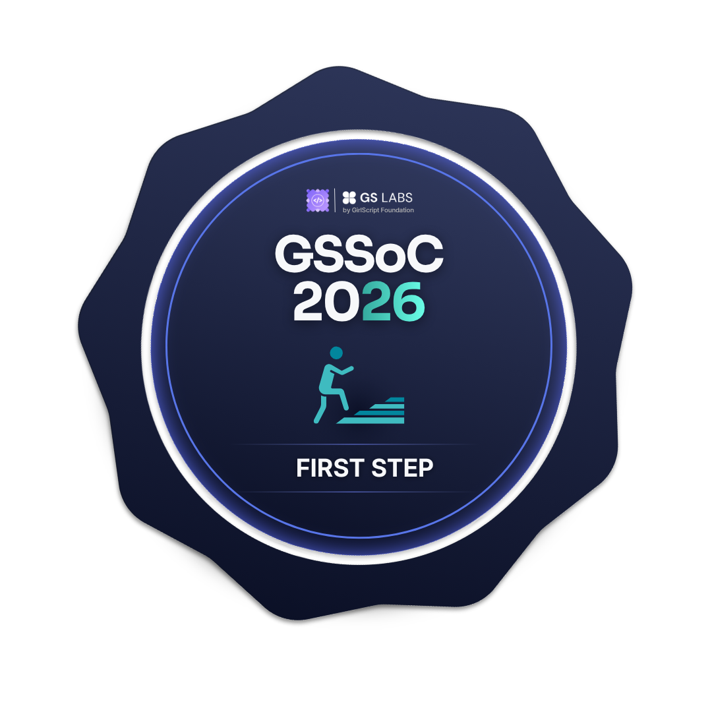

  

  

  
  
  

<h3 align="center">
🚀 Full Stack MERN Developer • GSSoC 2026 Mentor • Open Source Enthusiast
</h3>

Passionate about building impactful software, contributing to open source, solving DSA problems, and continuously learning modern technologies.

<!-- ===================== GSSoC BADGES ===================== -->
<h2 align="center">🏅 GSSoC 2026 Achievements</h2>

  
  
  
  

  
  
  
  

<!-- ========================= TECH STACK ========================= -->
<!-- ========================= TECH STACK ========================= -->

<h2 align="center">💻 Tech Stack</h2>

<!-- ========================= GRAPH ========================= -->

<h2 align="center">🏆 Featured Achievements</h2>

Building impactful projects, mentoring contributors, and continuously improving as a Full Stack Developer.

<h2 align="center">📈 Contribution Graph</h2>

<h2 align="center">🌐 Connect with Me</h2>

  

<h3 align="center">
💜 Thanks for visiting my profile! Let's build something amazing together.
</h3>
